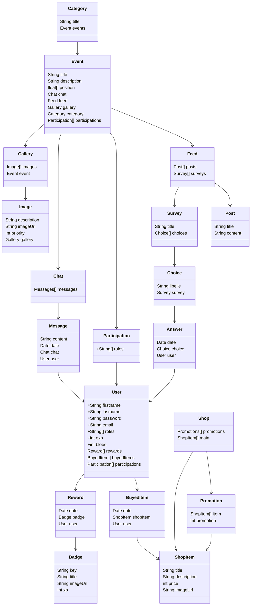

### Our UML diagram

```mermaid
classDiagram
    User-->BuyedItem
    User-->Reward
    class User {
        +String firstname
        +String lastname
        +String password
        +String email
        +String[] roles
        +int exp
        +int blobs
        Reward[] rewards
        BuyedItem[] buyedItems
        Participation[] participations
    }

    Participation-->User
    class Participation {
        +String[] roles
    }


    Event-->Feed
    Event-->Participation
    Event-->Chat
    Event-->Gallery
    class Event {
        String title
        String description
        float[] position
        Chat chat
        Feed feed
        Gallery gallery
        Category category
        Participation[] participations
    }

    Category-->Event
    class Category {
        String title
        Event events
    }


    Gallery-->Image
    class Gallery {
        Image[] images
        Event event
    }

    class Image {
        String description
        String imageUrl
        Int priority
        Gallery gallery
    }

    Feed-->Post
    Feed-->Survey
    class Feed {
        Post[] posts
        Survey[] surveys
    }

    class Post {
        String title
        String content
    }

    Survey-->Choice
    class Survey {
        String title
        Choice[] choices
    }

    class Choice {
        String libelle
        Survey survey
    }

    Answer-->User
    Choice-->Answer
    class Answer {
        Date date
        Choice choice
        User user
    }

    Chat-->Message
    class Chat {
        Messages[] messages
    }

    Message-->User
    class Message {
        String content
        Date date
        Chat chat
        User user
    }

    Shop-->Promotion
    Shop-->ShopItem
    class Shop {
        Promotions[] promotions
        ShopItem[] main
    }

    Promotion-->ShopItem
    class Promotion {
        ShopItem[] item
        Int promotion
    }

    class ShopItem {
        String title
        String description
        int price
        String imageUrl
    }

    BuyedItem-->ShopItem
    class BuyedItem {
        Date date
        ShopItem shopItem
        User user
    }


    class Badge {
        String key
        String title
        String imageUrl
        Int xp
    }

    Reward-->Badge
    class Reward {
        Date date
        Badge badge
        User user
    }
```
